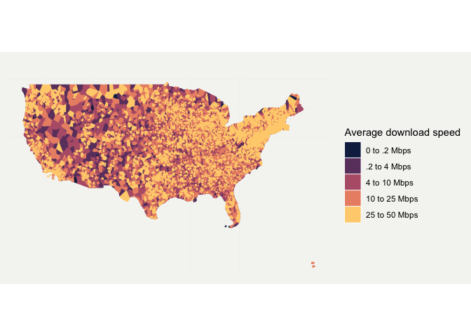

Internet speeds in GA
================
Nick Thieme
6/12/2019

### Introduction This is the code that goes along with the 6/12/2019
AJC story “Internet far slower in Georgia than reported.”

### Library

The analysis requires a couple out-of-R steps to function, and the
to\_BQ\_string function in the library does the heavy lifting with that.
That function takes an sf MultiPolygon geometry and makes it into the
right kind of string so that Google BigQuery will accept it. There are
also two SQL queries. The Big\_Q query is heavily cribbed from Georgia
Bullen of Simply Secure.

``` r
setwd("~/Desktop/R files/")
library(bigrquery)
library(tidyverse)
```
``` r
library(viridis)
```

``` r
library(lubridate)
```

``` r
library(sf)
```

``` r
library(tidycensus)
library(ggmap)
```

``` r
library(geojson)
```

``` r
library(geojsonsf)
```

``` r
project <- "NAME_OF_PROJECT"
stringify = function(x){
  z=apply(x, 1, paste, collapse = ", ")
  w<-str_c("[ ",z, " ]")
  return("Values"=w)
}

to_dataflow_string = function(dataflow_sf, file_name){
  require(sf)
  require(jsonlite)
  library(tools)
  ln_list<-nrow(dataflow_sf)
  dataflow_list <-vector(mode = "list",length=ln_list)
  
  for(i in 1:ln_list){
    num_polys<-length(dataflow_sf[i,]$geometry[[1]])
    if(num_polys==1){
      val <- tryCatch(stringify(dataflow_sf[i,]$geometry[[1]][[1]][[1]]),
                      error=function(e){return("e")})
      
      if(length(val)==1){
        val<-stringify(dataflow_sf[i,]$geometry[[1]][[1]])
      }
      
      dataflow_list[[i]]<-list("district"=dataflow_sf[i,]$GEOID, 
                               "Values"=val %>% str_c(collapse = ", ") %>% c("{\"type\":\"MultiPolygon\",\"coordinates\":[ [ [ ",.," ] ] ]}") %>% str_c(collapse = "")
      )
    }else{
      for(j in 1:num_polys){
        val <- tryCatch(stringify(dataflow_sf[i,]$geometry[[1]][[j]][[1]]),
                        error=function(e){return("e")})
        
        if(length(val)==1){
          val<-stringify(dataflow_sf[i,]$geometry[[1]][[j]])
        }
        
        curr_list<-list("district"=dataflow_sf[i,]$GEOID, 
                        "Values"=val %>% str_c(collapse = ", ") %>% c("{\"type\":\"MultiPolygon\",\"coordinates\":[ [ [ ",.," ] ] ]}") %>% str_c(collapse = "")
        )
        
        dataflow_list<-append(dataflow_list, list(curr_list), i-1)
      }
    }
  }
  
  lengths<-lapply(dataflow_list, length)
  dataflow_list_short<-dataflow_list[which(lengths==2)] %>% do.call("rbind",.) %>% data.frame %>% mutate_all(unlist)
  write_csv(dataflow_list_short, file_name, col_names = FALSE)
}

point_graph_BQ <- "#standardSQL

SELECT 
APPROX_QUANTILES(ml_download_Mbps, 101) [SAFE_ORDINAL(51)] AS med_dl_Mbps,
APPROX_QUANTILES(ml_download_Mbps, 101) [SAFE_ORDINAL(26)] AS qr_1_dl_Mbps,
APPROX_QUANTILES(ml_download_Mbps, 101) [SAFE_ORDINAL(76)] AS qr_3_dl_Mbps,
SUM(ml_dl_count_tests) as county_tests,
COUNT(DISTINCT ip),
partition_date,
long,
lat
FROM
(
  SELECT
  COUNT(test_id) AS ml_dl_count_tests,
  connection_spec.client_ip as ip,
  APPROX_QUANTILES(
    8 * SAFE_DIVIDE(
      web100_log_entry.snap.HCThruOctetsAcked,
      (
        web100_log_entry.snap.SndLimTimeRwin + web100_log_entry.snap.SndLimTimeCwnd + web100_log_entry.snap.SndLimTimeSnd
      )
    ),
    101 IGNORE NULLS
  ) [SAFE_ORDINAL(51)] AS ml_download_Mbps,
  partition_date,
  connection_spec.client_geolocation.longitude AS long,
  connection_spec.client_geolocation.latitude AS lat
  
  FROM 
  `measurement-lab.release.ndt_downloads` tests,
  `NAME_OF_PROJECT.NAME_OF_BUCKET.NAME_OF_DATASET.GA_internet.us_counties` counties
  WHERE
  connection_spec.server_geolocation.country_name = 'United States'
  AND (connection_spec.server_geolocation.region = 'Georgia' OR
  connection_spec.server_geolocation.region = 'GA')
  AND ST_WITHIN(
    ST_GeogPoint(
      connection_spec.client_geolocation.longitude,
      connection_spec.client_geolocation.latitude
    ),
    counties.Values
  )
  GROUP BY
  connection_spec.client_ip,
  long,
  lat,
  partition_date
)
GROUP BY
long,
lat,
partition_date
"

big_Q <- "#standardSQL
WITH counties AS (
  SELECT
    county_name AS name,
    county_geom AS geom,
    geo_id as geo_id
  FROM
    `NAME_OF_PROJECT.NAME_OF_BUCKET.NAME_OF_DATASET`
   WHERE 
   state_fips_code = 'STATE_CODE'
),
mlab_dl AS (
SELECT 
APPROX_QUANTILES(ml_download_Mbps, 101) [SAFE_ORDINAL(51)] AS med_dl_Mbps,
SUM(ml_dl_count_tests) as county_tests,
partition_date,
FORMAT(
      '%s_%d',
      ['jun', 'dec'] [ORDINAL(CAST(CEIL(EXTRACT(MONTH FROM partition_date) / 6) AS INT64))],
      EXTRACT(
        YEAR
        FROM
          partition_date
      )
) as time_period,
geo_id
FROM
(
  SELECT
  COUNT(test_id) AS ml_dl_count_tests,
  APPROX_QUANTILES(
    8 * SAFE_DIVIDE(
      web100_log_entry.snap.HCThruOctetsAcked,
      (
        web100_log_entry.snap.SndLimTimeRwin + web100_log_entry.snap.SndLimTimeCwnd + web100_log_entry.snap.SndLimTimeSnd
      )
    ),
    101 IGNORE NULLS
  ) [SAFE_ORDINAL(51)] AS ml_download_Mbps,
  partition_date,
  geo_id
  
  FROM 
  `measurement-lab.release.ndt_downloads` tests,
  `NAME_OF_PROJECT.NAME_OF_BUCKET.NAME_OF_DATASET` counties
  WHERE
  connection_spec.server_geolocation.country_name = 'United States'
  AND (connection_spec.server_geolocation.region = 'STATE_NAME' OR
  connection_spec.server_geolocation.region = 'STATE_ABBREVIATION')
  AND ST_WITHIN(
    ST_GeogPoint(
      connection_spec.client_geolocation.longitude,
      connection_spec.client_geolocation.latitude
    ),
    counties.Values
  )
  GROUP BY
  connection_spec.client_ip,
  geo_id,
  partition_date
)
GROUP BY
geo_id,
partition_date
),

mlab_ul AS (

SELECT 
APPROX_QUANTILES(ml_upload_Mbps, 101) [SAFE_ORDINAL(51)] AS med_ul_Mbps,
partition_date,
geo_id
FROM
(
  SELECT
  COUNT(test_id) AS ml_ul_count_tests,
  APPROX_QUANTILES(
 8 * SAFE_DIVIDE(
        web100_log_entry.snap.HCThruOctetsReceived,
        web100_log_entry.snap.Duration
),
    101 IGNORE NULLS
  ) [SAFE_ORDINAL(51)] AS ml_upload_Mbps,
  partition_date,
  geo_id
  
  FROM 
  `measurement-lab.release.ndt_uploads` tests,
  `NAME_OF_PROJECT.NAME_OF_BUCKET.NAME_OF_DATASET` counties
  WHERE
  connection_spec.server_geolocation.country_name = 'United States'
    AND (connection_spec.server_geolocation.region = 'STATE_NAME' OR
  connection_spec.server_geolocation.region = 'STATE_ABBREVIATION')
  AND ST_WITHIN(
    ST_GeogPoint(
      connection_spec.client_geolocation.longitude,
      connection_spec.client_geolocation.latitude
    ),
    counties.Values
  )
  GROUP BY
  connection_spec.client_ip,
  geo_id,
  partition_date
)
GROUP BY
geo_id,
partition_date
),
fccdata AS (
  SELECT *, 'dec_2014' AS time_period FROM `NAME_OF_PROJECT.NAME_OF_FCC_BUCKET.NAME_OF_DATASET_DEC_2014`
  UNION ALL SELECT *, 'dec_2015' AS time_period FROM `NAME_OF_PROJECT.NAME_OF_FCC_BUCKET.NAME_OF_DATASET_DEC_2015`
  UNION ALL SELECT *, 'dec_2016' AS time_period FROM `NAME_OF_PROJECT.NAME_OF_FCC_BUCKET.NAME_OF_DATASET_DEC_2016`
  UNION ALL SELECT *, 'jun_2015' AS time_period FROM `NAME_OF_PROJECT.NAME_OF_FCC_BUCKET.NAME_OF_DATASET_JUN_2015`
  UNION ALL SELECT *, 'jun_2016' AS time_period FROM `NAME_OF_PROJECT.NAME_OF_FCC_BUCKET.NAME_OF_DATASET_JUN_2016`
  UNION ALL SELECT *, 'jun_2017' AS time_period FROM `NAME_OF_PROJECT.NAME_OF_FCC_BUCKET.NAME_OF_DATASET_JUN_2017`
  UNION ALL SELECT *, 'dec_2017' AS time_period FROM `NAME_OF_PROJECT.NAME_OF_FCC_BUCKET.NAME_OF_DATASET_DEC_2017`,
  
),
fcc_providerMedians AS (
  SELECT
      time_period,
      APPROX_QUANTILES(CAST(Max_Advertised_Downstream_Speed__mbps_ AS FLOAT64), 101)[SAFE_ORDINAL(51)] AS advertised_down,
      APPROX_QUANTILES(CAST(Max_Advertised_Upstream_Speed__mbps_ AS FLOAT64), 101)[SAFE_ORDINAL(51)] AS advertised_up,
      MAX(CAST(Max_Advertised_Downstream_Speed__mbps_ AS FLOAT64)) AS advertised_down_max,
      SUBSTR(Census_Block_FIPS_Code, 0, 5) as geo_id
  FROM fccdata
  WHERE Consumer = '1'
  GROUP BY geo_id, time_period, FRN
),
fcc_groups AS (
  SELECT
      fccdata.time_period,
      COUNT(DISTINCT FRN) AS reg_provider_count, 
      APPROX_QUANTILES(fcc_providerMedians.advertised_down, 101)[SAFE_ORDINAL(51)] AS advertised_down,
      APPROX_QUANTILES(fcc_providerMedians.advertised_up, 101)[SAFE_ORDINAL(51)] AS advertised_up,
      MAX(CAST(Max_Advertised_Downstream_Speed__mbps_ AS FLOAT64)) AS advertised_down_max,
      SUBSTR(Census_Block_FIPS_Code, 0, 5) as geo_id
  FROM fccdata JOIN fcc_providerMedians 
  ON SUBSTR(fccdata.Census_Block_FIPS_Code, 0, 5) = fcc_providerMedians.geo_id AND fccdata.time_period = fcc_providerMedians.time_period 
  WHERE Consumer = '1'
  GROUP BY geo_id, time_period 
),
fcc_timeslices AS (
  SELECT 
    time_period,
    reg_provider_count,
    advertised_down,
    advertised_up,
    advertised_down_max,
    geo_id
  FROM fcc_groups
)
SELECT
      partition_date, 
      time_period,
      geo_id,
      med_dl_Mbps,
      med_ul_Mbps,
      county_tests,
      reg_provider_count,
      advertised_down,
      advertised_up,
      advertised_down_max
    
FROM
(mlab_dl JOIN mlab_ul USING (geo_id, partition_date) JOIN fcc_timeslices USING (geo_id, time_period))"
```

### R code

This section can be run right out of the box, once all dependencies have
been installed. It gets the county shapefiles from tidycensus and gets
them in the right format for BigQuery. The shapefile download takes a
minute or two because it gets the shapefiles for the entire country.
Feel free to modify the get\_acs call to shapefiles you’re interested
in. You can also set the state flag in the SQL calls above. Once running
this section, you’ll have to leave R, and work with Google Compute.

``` r
###This loads shapes and population from tidycensus
us <- unique(fips_codes$state)[1:51]
D_l <- vector(length = length(us), mode = "list")
D_l<-tigris::states()
```


``` r
D<-D_l  %>% st_as_sf

###This R object file is used in the Mapbox pipeline.

df_counties <- D%>%select(GEOID, geometry)
#to_dataflow_string(df_counties, "BQ_geo.csv")
```

### A brief aside in Google BigQuery to get BigRQuery to work

The meat of the analysis is done in Google BigQuery because M-Lab
provides a free way to work with their large internet speed database on
BigQuery. Storing the FCC files and the county files in a Google Bucket
will cost a little bit of money, but it should be less than a dollar for
this story.

Follow the instructions at :
<https://www.measurementlab.net/data/docs/bq/quickstart/> to get started
with BigQuery, and to get connected with the M-Lab datasets. The general
steps are installing the Google Cloud SDK and getting signed up on the
M-Lab message board to get access to their tables and so that the
BigQuery payments that would fall to you are covered by them.

Follow the instructions at:
<https://cloud.google.com/storage/docs/creating-buckets> to create
Google Bucket for your data. Upload the file “BQ\_geo.csv” to the Google
Bucket. This will give BigQuery the shapefiles it will perform spatial
joins on.

In BigQuery, (at <https://console.cloud.google.com/bigquery>) create a
dataset and name it whatever you like. I named mine GA\_internet. The
next step is to import BQ\_geo.csv into your dataset in BigQuery as
table by following the instructions here:
<https://cloud.google.com/bigquery/docs/loading-data-cloud-storage>. In
the “Create table” section, add two fields to the Schema. This lets
BigQuery know what form the data you’re uploading is in. Name the first
“districts” and the second “Values.” These names are important because
they match the SQL calls you’ll make later. Set the Type for the first
to “STRING” and the second to “GEOGRAPHY.” The table should appear under
your dataset. Finally, update the query point\_graph\_BQ above to
reflect the names of the datasets you uploaded and the geographic region
you’re interested in. For generality, I’m showing a map of the entire
U.S. below. Update project below to your project name.

Having done all that, the following section should run properly. This
sections uses the point\_graph\_BQ query to calculate the
median-of-medians average internet speed for every location IP addresses
are mapped to. The first median of the median-of-medians calculation is
done in BigQuery because it’s much faster, and for large areas that
often have hundreds of millions of tests, doing it locally just isn’t
possible.

``` r
point_data<-query_exec(point_graph_BQ, project = "NAME OF PROJECT", use_legacy_sql=FALSE, max_pages = Inf)
```

    ## Registered S3 method overwritten by 'openssl':
    ##   method      from
    ##   print.bytes Rcpp

    ## Auto-refreshing stale OAuth token.

    ## 0 bytes processed

``` r
point_data_sf<-point_data %>% 
  group_by(long, lat) %>% summarise(med = median(med_dl_Mbps), counts = sum(county_tests), ips = sum(f0_)) %>% st_as_sf(coords = c("long", "lat")) 

cuts<-c(0,.2, 4, 10, 25,1000)
colors_v<-viridis(7, option="magma")

point_data_sf_GA<-point_data_sf %>% na.omit %>% mutate(speed_mlab_c=cut(med, cuts))%>% mutate(
  speed_color = case_when(
    speed_mlab_c=="(0,0.2]"~colors_v[1],
    speed_mlab_c=="(0.2,4]"~colors_v[2],
    speed_mlab_c=="(4,10]"~colors_v[3],
    speed_mlab_c=="(10,25]"~colors_v[4],
    speed_mlab_c=="(25,1e+03]"~colors_v[5]
    
  )
) %>% mutate(
  speed_labels = case_when(
    speed_mlab_c=="(0,0.2]"~"0 to .2 Mbps",
    speed_mlab_c=="(0.2,4]"~".2 to 4 Mbps",
    speed_mlab_c=="(4,10]"~"4 to 10 Mbps",
    speed_mlab_c=="(10,25]"~"10 to 25 Mbps",
    speed_mlab_c=="(25,1e+03]"~"Over 25 Mbps"
    
  )
)
```

### R mapping

This section takes the data we’ve gotten and crunched, and turns it into
a map. Because the underlying data is technically point data
(latitude/longitude data), we have a couple choices on how to aggregate
it. In the GA story, the approach we took was to create a Voronoi
tessalation of the latitude/longitude data, and assigning to each
Voronoi polygon the internet speed of the latitude/longitude that
created it. Voronoi polygons
(<https://en.wikipedia.org/wiki/Voronoi_diagram>) are simple ways of
turning a set of points in a space into a set of polygons that partition
that space. In particular, the Voronoi polygon created by a point is the
area that’s closer to that point than any other point.

Other choices could have been census tracts or counties, but Voronoi
polygons struck a good balance between showing the variations in speed
that indicate *some* people have fast internet and the widespread slower
speeds that show the ISP data reported to the FCC overestimates the
state of internet speeds in GA.

The section below calculates the Voronoi polygons and makes a map out of
them.

``` r
USA_poly <-tigris::states() %>% st_as_sf %>% filter(NAME%in%c("Hawaii", "United State Virgin Islands","Commonwealth of the Northern Mariana Islands", "Guam","American Samoa","Alaska","Puerto Rico")==FALSE) %>% st_union 

voronoi_tess <- st_voronoi(do.call(c, point_data_sf_GA$geometry)) %>% st_collection_extract() %>% st_sf

st_crs(voronoi_tess)<-st_crs(USA_poly)
st_crs(point_data_sf_GA)<-st_crs(USA_poly)
voronoi_tess<-st_intersection(st_cast(voronoi_tess), USA_poly)
```

    ## Warning in st_is_longlat(x): bounding box has potentially an invalid value
    ## range for longlat data

    ## although coordinates are longitude/latitude, st_intersection assumes that they are planar

``` r
voronoi_tess  %>% st_join(point_data_sf_GA)%>%  ggplot(aes(color = speed_color, fill = speed_color)) +
  geom_sf() +
  scale_color_manual(values = c("#14274f","#6c406e","#b65f77","#eb9074","#ffd17d"),  
                     #labels = c("0 to .2 Mbps", ".2 to 4 Mbps","4 to 10 Mbps","10 to 25 Mbps","25 to 50 Mbps"),
                     labels = c("0 to .2 Mbps", ".2 to 4 Mbps","4 to 10 Mbps","10 to 25 Mbps","25 to 50 Mbps"),
                     name = "Average download speed")+
  scale_fill_manual(values = c("#14274f","#6c406e","#b65f77","#eb9074","#ffd17d"),  
                    labels = c("0 to .2 Mbps", ".2 to 4 Mbps","4 to 10 Mbps","10 to 25 Mbps","25 to 50 Mbps"),
                     name = "Average download speed")+theme(
                       axis.line = element_blank(),
                       axis.text.x = element_blank(),
                       axis.text.y = element_blank(),
                       axis.ticks = element_blank(),
                       axis.title.x = element_blank(),
                       axis.title.y = element_blank(),
                       # panel.grid.minor = element_line(color = "#ebebe5", size = 0.2),
                       panel.grid.major = element_line(color = "#ebebe5", size = 0.2),
                       panel.grid.minor = element_blank(),
                       plot.background = element_rect(fill = "#f5f5f2", color = NA), 
                       panel.background = element_rect(fill = "#f5f5f2", color = NA), 
                       legend.background = element_rect(fill = "#f5f5f2", color = NA),
                       panel.border = element_blank()
                     )+labs(title="")
```

    ## although coordinates are longitude/latitude, st_intersects assumes that they are planar

<!-- -->

### FCC comparison

This section compares FCC 477 data with the M-Lab data. Twice a year,
ISPs are required to submit a Form 477 to the FCC detailing the maximum
speed they make available at the census blocks they serve in the U.S.
That data is put together and made publicly available online at
<https://www.fcc.gov/general/broadband-deployment-data-fcc-form-477>.
Each dataset is about 400 MB. To run the code below, download all of the
FCC releases, ranging from December 2014 to December 2017, and upload
them to your Google Bucket. Import them into separate tables in your
BigQuery dataset with names that you choose. Then update big\_Q above to
reflect the names of your FCC tables, and you should be good to
go.

big\_Q is a pretty involved query so it may not be immediately clear what's going on or wrong with it. I've found that it's a lot easier to debug these queries in BigQuery itself. The lag between error and a retooled query is shorter, and simple errors are caught prior to running.  

``` r
D_state_county<-query_exec(big_Q, project = project,use_legacy_sql=FALSE, max_pages = Inf )

D_state_county %>% filter(time_period=="dec_2017"&str_sub(geo_id,1,2)=="STATE FIPS CODE") %>% 
  summarise(fcc_dl =median(advertised_down), dl= median(med_dl_Mbps)) #25 fcc, 6.26 mlab

point_data_sf_GA %>% filter(str_sub(county,1,2)=="13") %>% summarise(sum(counts), sum(ips), median(med))
  pull(counts) %>% sum
```

### Questions or Comments

If you have any questions or comments, I'm all ears. Please write me at nicholas.thieme@ajc.com
